<div align="center">

# Runcible

Learn a subject from a book that teaches back: graded chapters, drills and games with progress that follows you, starting with Japanese

[![Live][badge-site]][url-site]
[![HTML5][badge-html]][url-html]
[![CSS3][badge-css]][url-css]
[![JavaScript][badge-js]][url-js]
[![Claude Code][badge-claude]][url-claude]
[![License][badge-license]](LICENSE)

[badge-site]:    https://img.shields.io/badge/live_site-0063e5?style=for-the-badge&logo=googlechrome&logoColor=white
[badge-html]:    https://img.shields.io/badge/HTML5-E34F26?style=for-the-badge&logo=html5&logoColor=white
[badge-css]:     https://img.shields.io/badge/CSS3-1572B6?style=for-the-badge&logo=css3&logoColor=white
[badge-js]:      https://img.shields.io/badge/JavaScript-F7DF1E?style=for-the-badge&logo=javascript&logoColor=black
[badge-claude]:  https://img.shields.io/badge/Claude_Code-CC785C?style=for-the-badge&logo=anthropic&logoColor=white
[badge-license]: https://img.shields.io/badge/license-MIT-404040?style=for-the-badge

[url-site]:   https://runcible.neorgon.com/
[url-html]:   #
[url-css]:    #
[url-js]:     #
[url-claude]: https://claude.ai/code

</div>

---

## Overview

Runcible is a learning book that grades you. A Book is a ladder of chapters,
each stated as something you will be able to do and each carrying the drills
that prove it; the next chapter opens when the evidence says so, and every
locked gate has a visible "open anyway". The shell knows nothing about any
subject: a Book is a directory of JSON under `books/`, and the shell provides
nine generic exercise types, a Today view that picks the next lesson and the
weakest skill for you, and a two-language reader. The first Book is Japanese,
from why they say gandamu to reading a song line; the second is a Piano stub
that exists to prove the shell is not Japanese-shaped. The name is the Primer's
from The Diamond Age.

**Live:** runcible.neorgon.com

---

## Features

- **Books are data** -- a Book is `books/<id>/book.json` plus chapter files. Adding one is one entry in `books/index.json` and one directory; the Piano stub was added with no change under `js/`
- **Nine generic exercise types** -- `read`, `choice`, `typed`, `match`, `order`, `listen`, `speak`, `deck` and `custom`, none of which names a topic. A Book adds its own types and input transforms as ES modules it declares in its manifest
- **Evidence, not completion** -- a chapter passes when, over the last `window` graded attempts on its skill, at least `min` exist and `accuracy` of them were right. Reading pages records dwell time and passes nothing
- **Every gate opens by hand** -- a locked chapter carries a visible override; the Today view lists the gates you opened yourself and keeps them marked not passed
- **Today** -- one screen answering "what do I do now": the next lesson's first unfinished rung, the decks the engine says are due, the weakest skills and the items you last got wrong, and one game from a chapter you can already open
- **Tracks** -- a Book can declare several orders through the same chapters (the Japanese Book ships textbook, kanji-first and immersion) and a chapter's prerequisites can differ per track
- **Spaced review by iframe** -- a `deck` exercise embeds a Rappel session from `rappel.neorgon.com`; every `rappel:answer` becomes an attempt against the chapter's skill, and an "Open in Rappel" link is always beside it
- **Romaji typing that settles** -- the Japanese Book registers a `kana` transform that converts as you type and settles the trailing `n` once at submit, so `shinbun` grades as しんぶん rather than しんぶn
- **Speech that degrades honestly** -- `listen` waits for `voiceschanged`, falls back to text when the language has no voice, and skips a question whose only prompt is audio rather than showing it unanswerable. `speak` is never graded
- **Licence as a render property** -- a chapter's screen shows the EDRDG, KanjiVG or Tatoeba acknowledgement because a declared data file said `screen: "required"`, not because an author remembered
- **English and Spanish** -- every content field is a string or `{ en, es }`; a page shown in Spanish with untranslated content says so once instead of half translating
- **Local-first, keyboard-first** -- progress lives in `localStorage`; digits pick options, Enter advances, and every drill runs without a pointer. Sync to an account is dormant until a Clerk key is on the page

---

## Running locally

ES modules require an HTTP server (not `file://`):

```bash
make serve
```

Then open http://localhost:8878. The dev server is `scripts/serve.py`, which
adds `Cache-Control: no-cache` and the CORS header the Rappel engine needs to
fetch a deck across origins. A `deck` exercise on localhost embeds
`http://localhost:8879`, so run `make serve` in `projects/rappel-site/` too when
you want to see one.

Before any change under `books/` or `data/` lands:

```bash
make validate    # check-licence, validate-book, the shell rules, validate-corpus
```

It exits 0 or names the file and the field. Nothing runs it for you: it is not
in the root `make smoke`. The Book validator is the same module the shell
imports at load time, so there is one notion of valid.

The engine has its own rig at `/js/exercises/fixtures/harness.html`: one
exercise of each type over a solar-system chapter, so the engine's tests cannot
learn Japanese by accident.

---

## How it fits the fleet

Runcible and [Rappel](https://rappel.neorgon.com/) are two origins with no
shared code. The only coupling is `neo-rappel-embed/1`: Runcible builds an
iframe URL (`?embed=1&mode=review&limit=20&src=<deck json on this origin>`),
greets the engine with `rappel:hello` on load, and turns each `rappel:answer`
into an attempt with `source: 'rappel'`. Every message carries `v: 1` in both
directions, and the host ignores any origin or version it does not know.
Rappel's `llms.txt` publishes the full vocabulary.

The review ledger lives on Rappel's origin. Inside `runcible.neorgon.com` that
is a same-site embed, so the embedded deck and standalone Rappel share one
ledger in Chrome and Firefox; a third-party host gets its own partition, and
when the engine cannot write it reports `ledger: "ephemeral"` and the host says
so on the page.

Header, footer, beacon and persist kits are vendored from
`packages/neorgon-ui/`, and the two storage keys follow the fleet spelling:
`runcible:prefs:v1` and `runcible:progress:v1`.

---

## Data and licences

The site is MIT, and `data/` is not. Every file under `data/` opens with a
`_licence` block naming its source, its SPDX id and whether an acknowledgement
must render on screen, and the Book manifest's `data[]` repeats the obligation
so the shell can act on it before the file is fetched.

| Source | Files | Licence | Obligation |
|---|---|---|---|
| JMdict and KANJIDIC2, via jmdict-simplified `3.6.2+20260831182826` | `data/vocab/`, `data/kanji/kanjidic-*.json`, `data/loanwords/seed.json`, three decks | CC BY-SA 4.0 | The EDRDG statement, in its own wording, on every screen that shows a dictionary word, with links to the JMdict and KANJIDIC project pages |
| KanjiVG `r20250816` | `data/kanji/strokes-*.json` | CC BY-SA 3.0 | Name KanjiVG and link http://kanjivg.tagaini.net |
| Tatoeba, export of 2026-08-29 | `data/sentences/`, one deck | CC BY 2.0 FR | Name Tatoeba and link https://tatoeba.org/en/downloads |
| Wikipedia, and the Agency for Cultural Affairs notices it quotes | `data/loanwords/rules.json` | CC BY-SA 4.0 | Attribution on screen |
| 19 Japanese songs verified public domain in Japan and the US | `data/songs/` | public domain | None. Each file carries both verdicts, the basis and a verse limit |
| wanakana 5.3.1 | `js/vendor/wanakana.js` | MIT | Licence header kept in the file |

Derived data inherits the share-alike licence of its source, so a trimmed
vocabulary file made from JMdict is CC BY-SA 4.0 whatever the repo says. The
`data/` slices are produced by hand with `tools/build-*.mjs` from pinned
upstream releases (URL, byte count and SHA-256 in `tools/lib/sources.mjs`) and
committed; the site never fetches an upstream. `tools/check-licence.mjs` fails
the build on a missing `_licence` block, on a song carrying more verses than
its file permits, and on any of five song titles that are not public domain
appearing anywhere under `books/`, `data/`, `js/` or `tools/`. Full detail,
including the five titles by description and why there are exactly 19 songs:
`data/README.md`.

---

## Architecture



Zero build: plain ES modules, static JSON, one vendored library. The Convex
backend is optional and never contacted without a `clerk-publishable-key`
meta on the page.

```
runcible-site/
├── index.html                  # HTML shell: header kit, #view, footer kit
├── llms.txt                    # The Book package format, for an LLM authoring a Book
├── css/style.css               # Site styles. Identity is --accent: #e11d48; the rest is CDN base.css
├── js/
│   ├── app.js                  # Entry point, 19 lines
│   ├── state.js                # runcible:prefs:v1, runcible:progress:v1, the sync bridge
│   ├── router.js               # Hash routes: #/, #/books, #/b/<book>, #/b/<book>/<chapter>, #/settings
│   ├── events.js               # One delegated data-action handler. No inline onclick
│   ├── render.js               # Every view. Text nodes only, no innerHTML
│   ├── books.js                # Catalog, manifest, chapters, the data[] permission list, pointers, attributions
│   ├── progress.js             # Attempts, skill evidence, chapter state, override, weak items
│   ├── today.js                # Composes the Today view
│   ├── embed.js                # The Rappel iframe host: hello, answer to attempt, due counts
│   ├── i18n.js                 # {en,es} resolver and UI copy
│   ├── sync.js                 # Brokered Convex client, dormant without a Clerk key
│   ├── exercises/              # The engine: registry, spec, session, items, compare, speech, types/
│   │   ├── index.js            # The only import the shell uses from this directory
│   │   ├── spec.js             # The nine types and their required fields
│   │   ├── types/*.js          # read choice typed match order listen speak deck custom
│   │   └── fixtures/           # harness.html: one of each type over a solar-system chapter
│   ├── vendor/wanakana.js      # 5.3.1, MIT, never hot-linked
│   └── neorgon-*.js            # Header, footer, beacon and persist kits, vendored
├── books/
│   ├── index.json              # The catalog: neo-book-index/1
│   ├── japanese/               # book.json, chapters/*.json, exercises/*.js, decks/*.json
│   └── piano/                  # book.json and three chapters. No modules, no data
├── data/                       # The corpus. Every file opens with _licence. See data/README.md
├── tools/                      # Manual data step and validators, plain node, no install
│   ├── validate-book.mjs       # neo-book-index/1, neo-book/1, neo-chapter/1. Also imported by the shell
│   ├── check-licence.mjs       # Banned songs, _licence blocks, verse limits, exactly 19 songs
│   ├── validate-corpus.mjs     # Derived corpus formats, 150 KB cap, dash rule in strings
│   └── build-*.mjs             # JMdict, KANJIDIC2, KanjiVG, Tatoeba slices and the decks
├── convex/                     # progress, evidence, prefs. Optional backend, see convex/README.md
├── docs/architecture.mmd       # Source for architecture.svg
├── 404.html
├── CNAME
├── Makefile
└── README.md
```

### Backend

```
convex/
├── schema.ts                   # progress, evidence, prefs: every row owned by its clerkSubject
├── progress.ts                 # pull, push, clear. Identity check, then model/
├── model/progress.ts           # The data half, owner passed in
├── merge.ts                    # Per-row last-write-wins; evidence rows are deltas and are summed
├── merge.test.ts               # npm test, plain node, no deployment
└── auth.config.ts              # The fleet's shared Clerk dev instance
```

---

<div align="center">
<sub>Part of <a href="https://neorgon.com/">Neorgon</a></sub>
</div>
