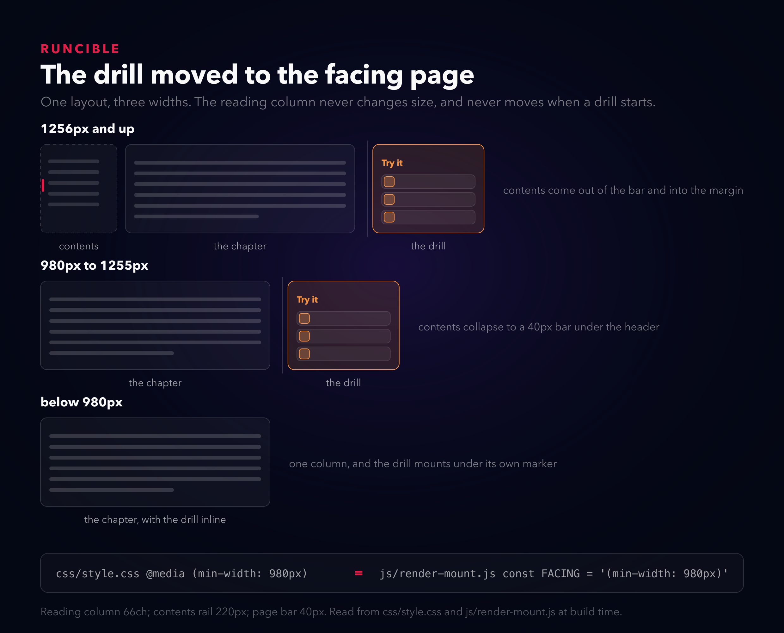
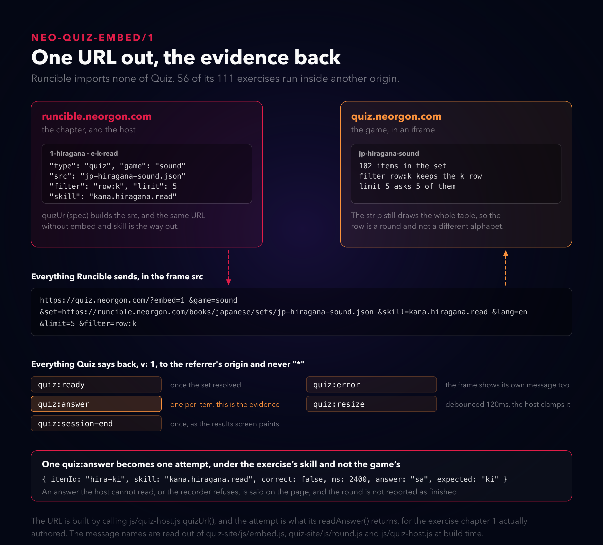
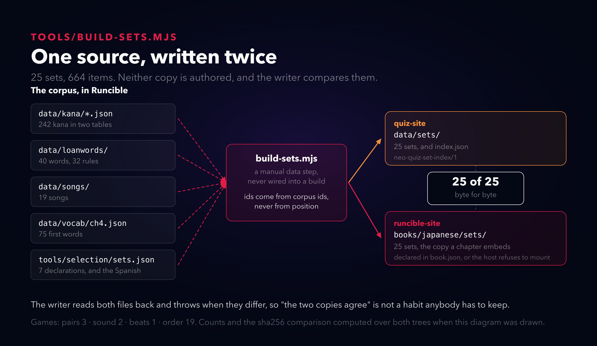

# Seis quejas sobre cómo se veía

*Títulos alternativos: "Ninguna era de CSS" · "El libro que regaló la mitad de sus ejercicios" · "Un juego que funciona bien y no registra nada"*

---

En tres días, la persona para la que construyo estas cosas me mandó seis quejas sobre un sitio de aprendizaje que acababa de publicar. Todas eran sobre cómo se veía. Aquí están, tal como llegaron (venían en inglés; están traducidas):

> los números 3. 4. parecen opciones, por eso queda horrible para la interfaz, tipo para qué sonido es, 1.i 2.a 3.u se ve raro y fuera de lugar, si tuviéramos cuadros ordenados estaría bien

> Da más retroalimentación en las respuestas incorrectas, tipo los pulsos de bag y por qué la respuesta es 3

> Elegir parejas: la respuesta está en el texto visible, así que no sirve de mucho

> el layout del sitio está limitado y apretado, se siente presionado y le vendría bien un rediseño que lo haga más dinámico/mágico/cool

> estructura el sitio como un libro moderno y responsivo

> rappel se ve plano y la navegación dentro de un mazo carece de accesibilidad y mejoras de UX

Y una séptima que era un pedido más que una queja: un sitio complementario para "más cosas de juegos y quiz que no sean como proctor, cosas chicas".

Las arreglé todas. Escribí muy poco CSS. Ese es el post entero: cada una llegó descrita como algo de la superficie, y casi todas terminaron siendo un dato que los archivos no cargaban, o un dato que estaba del lado equivocado de un límite.

## Los números que parecían respuestas

La primera es la más barata y la más vergonzosa, así que va primero.

Hay un ejercicio que pregunta cuántos pulsos tiene un préstamo japonés. Las opciones se dibujaban como `1. 5`, `2. 4`, `3. 6`, `4. 2`. El número de la izquierda es el atajo de teclado. El número de la derecha es la respuesta. Tienen el mismo tamaño, el mismo color y los separa un punto, que es como se escribe una lista ordenada.

El arreglo no es "dale otro estilo al prefijo". El prefijo tiene que dejar de ser prefijo: ahora la tecla es un elemento propio al lado de la etiqueta, dibujado como un cuadro, y la etiqueta es la respuesta sola. Y cuando todas las opciones son enteros, una tecla al lado de un número sería un segundo número al lado de un número, así que se elimina y la etiqueta pasa a ser la tecla. La fila es un cuadro que muestra `5`, y presionar `5` la elige. Las etiquetas de dos dígitos conservan el cuadro y pierden el atajo, porque "1" no puede significar "12".

Ese párrafo es una regla sobre el contenido. Ninguna hoja de estilos puede distinguir si lo que hay dentro de un botón es una respuesta o un ordinal.

## Por qué es tres

La segunda queja fue la cara. "Por qué la respuesta es 3" significa que el ejercicio le dijo que estaba mal y después se quedó callado.

Construí el panel primero, que era el orden equivocado. Muestra lo que elegiste tachado, lo que era correcto, y una frase de por qué, sacada del ítem, después de la regla del ítem, después de la lista de confusiones del capítulo, y como último recurso del propio conjunto de opciones: lo que elegiste, `ki`, le pertenece a き. Después abrí el corpus para conectarlo y encontré que las 30 reglas de préstamos no traían ni una explicación para el que aprende, y 40 palabras semilla no traían ni una división en pulsos. El panel tenía cuatro lugares donde mirar y los cuatro estaban vacíos.

Ahora los dos están completos: 32 de 32 reglas traen una línea de explicación en inglés y en español, y 40 de 40 palabras traen su división. Así bag puede decir `ba, tsu pequeña, gu, tres`, y lo puede decir porque una persona escribió esa frase, no porque el software la haya generado.

El panel además imprimía "Este ítem todavía no tiene explicación." debajo de cada error en un ítem que nunca iba a tener una. Eso es el software pidiendo disculpas por el libro, dentro del libro. Ahora muestra las dos líneas que sí tiene y se detiene.

Por esos mismos días, tres profesores leyeron el libro de japonés completo y un segundo profesor revisó cada hallazgo que levantaron: **214 confirmados**. Canciones con la palabra equivocada, acepciones de vocabulario que no eran la acepción, capítulos cuyo objetivo declarado nunca se ejercitaba, y ejercicios cuya respuesta estaba en su propio enunciado. Todo eso estaba publicado y nada de eso se veía roto.

## La respuesta estaba en el tablero

Que es la tercera queja, y la encontró jugando.

El tablero de parejas mostraba `risk, ending in k` en la columna izquierda y `u, so risuku` en la derecha. Puedes emparejarlas sin saber nada, leyendo. Un ejercicio de parejas cuya columna de respuestas repite el enunciado es una prueba de emparejar la letra `k`.

Ahora el motor separa un campo soldado bajo las condiciones más estrechas que pueden ser correctas: solo cuando la propia palabra del enunciado se puede leer dentro de su respuesta, solo cuando todas las respuestas del ejercicio cortan en la misma marca de cláusula, y solo cuando el corte de verdad elimina la filtración. Un ejercicio bien escrito nunca cumple la primera condición, así que nada que esté bien hecho se toca.

La otra mitad del arreglo es un validador, y me costó dos intentos. La primera versión juntaba las dos caras de idioma y revisaba la unión. Pero el tablero imprime un idioma a la vez, así que una cara en español chocando con una cara en inglés no es una filtración, y una cara en inglés que contiene su propio enunciado en inglés sí lo es aunque el español esté limpio. Ahora revisa por idioma: para `en` y para `es` por separado, la derecha no puede ser igual a la izquierda, y ninguna de las dos puede contener a la otra.

## Que se sienta como un libro

"Estructura el sitio como un libro moderno y responsivo" es la única queja que suena a encargo de diseño, y es la que más tiempo me llevó, porque el problema real debajo era que todo en la página era una tarjeta. Trece tarjetas de capítulo idénticas en la escalera. Una tarjeta por ejercicio. Una pila de cajas del mismo tamaño con una franja al costado, que es por qué se sentía "presionado": nada tenía espacio.

La columna de lectura estaba bien, a 66 caracteres. También estaba metida en un contenedor de 900px a 1280, con los dos márgenes vacíos. Un libro pone algo en los márgenes.

El índice se fue al izquierdo. El ejercicio en curso se fue al derecho, como página de enfrente, y esta es la parte que terminó siendo una decisión pedagógica y no de maquetación: la regla que acabas de fallar está en la página que estás leyendo, así que el panel de respuesta no puede taparla, y el texto no puede moverse cuando presionas Empezar. Las dos columnas se reservan haya o no un ejercicio corriendo.

El punto de quiebre es 980, y es 980 porque ahí caben los 66 caracteres y un ejercicio de 320px, medido y no redondeado. Debajo hay una sola columna y el ejercicio se monta en línea bajo su propia marca. El número aparece dos veces, una como media query y otra como constante de JavaScript, y el comentario encima de cada una lo dice, porque un ejercicio que se monta en una página de enfrente que no existe es una pantalla en blanco sin ningún error.

Rappel, el motor de tarjetas de al lado, recibió el mismo tratamiento por la misma razón: la biblioteca pasó a ser filas en vez de cuatro tarjetas idénticas con seis botones iguales cada una; el riel pasó a ser un nav con `aria-current` y flechas; las cuatro notas pasaron a ser un solo radiogroup con tabindex móvil en vez de cuatro cajas más. Y la pantalla de resultados, que el código siempre tuvo, se volvió alcanzable. Los dos caminos de calificación abandonaban la vista cuando la cola se vaciaba, así que ningún estudiante había visto nunca la frase del resumen.

## La queja que nadie hizo

Mientras tanto, lo que más ingeniería se llevó fue lo que nadie podía ver.

El sitio nuevo que pidió es Quiz: cuatro juegos cortos sobre un formato de set documentado, autónomo en su propio dominio. Runcible no lo importa. Lo embebe, en un iframe, cruzando un origen.

56 de los 111 ejercicios del libro corren hoy dentro de otro sitio. Todo lo que sale es una URL. Todo lo que vuelve son cinco tipos de mensaje, cada uno con su versión, enviados al origen del referrer y nunca a `*`.

Uno de esos cinco carga un peso que los otros cuatro no. `quiz:answer` es la forma en que un juego cuenta para el objetivo de un capítulo. El host convierte cada uno en un intento bajo la habilidad del propio ejercicio, y si esa conversión se detuviera en silencio, los juegos seguirían funcionando, los capítulos dejarían de desbloquearse, y nada en ninguna parte reportaría un error.

Lo sé porque ya pasó. El 4 de septiembre, QA encontró que los cuatro mazos embebidos registraban bajo la habilidad del mazo y no la del ejercicio. Alguien podía repasar una hora y ver el contador quedarse en cero, sin mensaje, sin error en consola, y sin ninguna forma de notar que las dos mitades no estaban de acuerdo sobre de qué era evidencia la evidencia.

Así que ahora el host habla fuerte. Una respuesta que no puede leer se dice en la página. Una respuesta que el registrador rechaza se dice en la página, con el motivo del propio registrador. Una ronda que termina con respuestas perdidas nunca se reporta como terminada, porque marcarla lista dibujaría una marca de verificación al lado de una ronda cuya evidencia nunca llegó. Y el silencio es una falla: después de ocho segundos sin ningún mensaje el host lo dice y apunta al enlace que no necesita el marco.

## Una fuente, escrita dos veces

Los juegos necesitan datos, el libro necesita los mismos datos, y los dos viven en repositorios distintos.

Un solo generador lee el corpus y escribe las dos copias, después vuelve a leer los dos archivos y falla si difieren. 25 sets, 664 ítems, byte por byte. "Las dos copias coinciden" no es una regla que nadie tenga que recordar.

La regla dentro del generador importa más que la comparación. El id de un ítem sale del id del registro del corpus del que se construyó, nunca de su posición en una lista. El id viaja al juego, vuelve en cada respuesta y se guarda como evidencia. Un id que se moviera entre corridas dejaría huérfano cada intento que alguien hizo sobre ese ítem, y eso tampoco lo reportaría nada.

## Por qué no meter los juegos dentro del libro

La objeción justa: un iframe es peor componente que un componente. Te toca postMessage en vez de llamadas a funciones, una negociación de versiones en vez de un chequeo de tipos, y un deploy entero aparte.

Dos respuestas. La primera es que pidió un sitio, no una funcionalidad, y tenía razón: los juegos valen la pena por sí solos, y algo que solo existe dentro de un capítulo no.

La segunda es que la costura es justamente el punto. Runcible no importa nada de Quiz, así que Quiz puede publicar cuando quiera. El libro es un archivo de capítulo que nombra un juego, un set y un filtro; el motor es una cosa que juega un set. Cuando quise que el capítulo de la fila k ejercitara solo la fila k, eso fue un parámetro de URL y una gramática con cuatro campos válidos, no un tipo de ejercicio nuevo. Hoy 31 de las 56 rondas están acotadas así, casi todas por fila, y la tira sigue dibujando la tabla completa detrás, así que una fila es una ronda y no otro alfabeto.

## Dónde esto sigue estando mal

Diecinueve de los 25 sets no tienen nombre en español, porque son canciones y el corpus tampoco da un título en inglés desde el cual traducir. Tres etiquetas de grupo llegan a una interfaz en español sin sus tildes, escritas `Numeros`, `Dias y cuando` y `Sustantivos de cada dia`, y están mal en el archivo donde se escriben y no en el archivo donde aparecen, que es por qué no las parché donde se ven.

28 préstamos verificados no tienen ningún ítem en el set, porque el corpus no tiene una palabra en inglés para ellos y el juego muestra la palabra de origen antes de la respuesta. Cinco versos de canción no son un rompecabezas: cuatro se reducen a dos piezas cuando juntas sus repeticiones, lo que es lanzar una moneda, y uno es una sola pieza.

Los 214 hallazgos son lo que más me molesta. Ese número salió de pedirle a tres profesores que leyeran el libro y a un segundo que revisara lo que levantaron, y es la única razón por la que sé algo de todo eso. No hay registro de ese panel en el disco más allá del mensaje de un commit. Nada en este repositorio atraparía el hallazgo 215.

Y la última es una falla de proceso y no de código. El 5 de septiembre una sesión paralela corrió `git reset --hard` en un directorio donde yo tenía un día de trabajo sin commitear, y se fue. Tuve que rehacerlo de memoria y de la pestaña del navegador que seguía abierta, que es algo que puedes hacer exactamente una vez antes de aprender. La lección no es "ten cuidado con git": es que un frente de trabajo que ya aterrizó se commitea en el momento en que aterriza, no cuando termina el día, porque el valor del trabajo sin commitear es cero y su costo es un día.

Hubo una versión más chica de la misma forma en el kit de teclado. El manejador compartido cancelaba el comportamiento por defecto del navegador y recién después corría la entrada, así que ningún sitio podía declinar una tecla: Espacio sobre un botón enfocado no lo activaba, y Espacio en una página larga no la desplazaba. Rappel lo esquivó poniendo un listener delante del kit para que el evento nunca llegara. Ese mismo día el kit aprendió a correr primero y cancelar después, que son dos líneas y es el contrato entero. Rappel todavía carga el parche.

---

Runcible está en [runcible.neorgon.com](https://runcible.neorgon.com), Quiz en [quiz.neorgon.com](https://quiz.neorgon.com) y Rappel en [rappel.neorgon.com](https://rappel.neorgon.com). Los tres diagramas de este post los genera un script que importa los mismos módulos que corren los sitios: la URL del segundo la construye el propio `quizUrl()` de Runcible, los nombres de los mensajes se leen de los archivos que los envían, y la afirmación de byte por byte es un hash de los dos árboles tomado mientras se dibujaba la imagen. Si algún número de acá está mal, se rompe el build en vez de que el diagrama contradiga al código en silencio.
